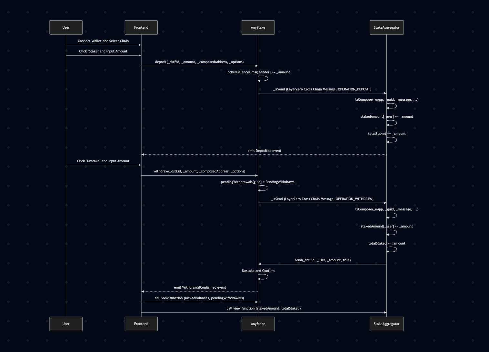

<p align="center">
  
</p>

# AnyStake

**The Future of DeFi is Cross-Chain — Powered by Flow, Ethereum, and More**

AnyStake is a next-generation cross-chain staking protocol that aggregates liquidity and staking opportunities across Flow, Ethereum, Hedera and other leading blockchains. Built for seamless user experience and global liquidity, AnyStake enables users to stake, bridge, and earn yield across multiple chains from a single interface.

## 🚀 Key Features
- **Cross-Chain Staking Aggregator:** Stake assets from Flow, Ethereum, Hedera and more into unified high-yield pools.
- **Flow Integration:** Directly bridge and stake assets from Flow, unlocking new DeFi opportunities.
- **Unified Dashboard:** Track balances, rewards, and positions across all supported chains in real time.
- **Seamless UX:** Effortless wallet connection, chain switching, and transaction monitoring.
- **[LayerZero Messaging](https://layerzero.network/):** Secure, reliable cross-chain communication and asset transfer.

## 🌉 Why Cross-Chain & Why LayerZero?
- **Breaks DeFi Silos:** Bridges liquidity between Flow and EVM chains but not using bridge.
- **Composable Primitives:** Enables new DeFi strategies and products that rely on multi-chain flows of assets and data.
- **Global Liquidity:** Connects Flow to the global DeFi ecosystem, maximizing yield and opportunity.

## 🛠️ Getting Started

Clone the repo and install dependencies:

```bash
git clone https://github.com/timothyshen/ethprague2025
cd ethprague2025
pnpm install # or yarn install or npm install
```

Start the development server:

```bash
pnpm dev # or yarn dev or npm run dev
```

Open [http://localhost:3000](http://localhost:3000) to view the app.

## ⚙️ Environment Variables

Create a `.env` file using  `env-example` and set the following:

```
NEXT_PUBLIC_ALCHEMY_API_KEY=your_alchemy_key
NEXT_PUBLIC_WALLETCONNECT_PROJECT_ID=your_walletconnect_id
```

## 📝 Project Structure
- `app/` — Next.js app directory
- `components/` — UI and logic components
- `hooks/` — Custom React hooks (Web3, staking, etc.)
- `contract/` — Solidity smart contracts, LayerZero config, deployment scripts
- `public/` — Static assets (including logo)

## 📜 Smart Contracts

This project includes two core smart contracts in `contract/contracts/`:

### `AnyStake.sol`
- **Purpose:** The main omnichain staking contract, built as a LayerZero `OApp`.
- **Key Features:**
  - Handles cross-chain staking and withdrawal requests using LayerZero messaging.
  - Manages user locked balances and pending withdrawals.
  - Emits events for deposits, withdrawals, and cross-chain message operations.
  - Provides quoting functions for cross-chain messaging fees.
- **How it works:** Users deposit (stake) or withdraw assets, which triggers cross-chain messages to other supported chains. The contract tracks balances and coordinates with the aggregator for confirmation and settlement.

### `StakeAggregator.sol`
- **Purpose:** Aggregates staking operations and acts as a cross-chain coordinator.
- **Key Features:**
  - Receives and processes cross-chain composed messages from `AnyStake`.
  - Updates user and total staked balances.
  - Sends confirmations back to the source chain via `AnyStake`.
  - Allows local staking and withdrawal for testing or non-cross-chain use.
- **How it works:** When a cross-chain staking or withdrawal message is received(via `lzCompose`), the aggregator updates balances and sends a confirmation back to the originating chain, ensuring state consistency across chains.

<p align="center">
  
</p>

### 🛠️ Contract Development & Deployment

- Contracts are written in Solidity (`^0.8.22`).
- Uses [LayerZero OApp](https://docs.layerzero.network/contracts/oapp) for omnichain messaging.
- Deployment and wiring scripts are in the `contract/` folder.
- See `contract/README.md` for detailed instructions on compiling, testing, deploying, and wiring contracts across chains.

## 🤝 Credits
- Built with [Next.js](https://nextjs.org/), [wagmi](https://wagmi.sh/), [ConnectKit](https://connectkit.dev/), [LayerZero](https://layerzero.network/), and [Flow](https://www.flow.com/).
- Learn more about LayerZero at [layerzero.network](https://layerzero.network/).
- Inspired by the vision of a truly cross-chain DeFi future.

---


<p align="center">
  <b>Build the next generation of DeFi that breaks silos and brings Flow into the global liquidity network.</b>
</p>


